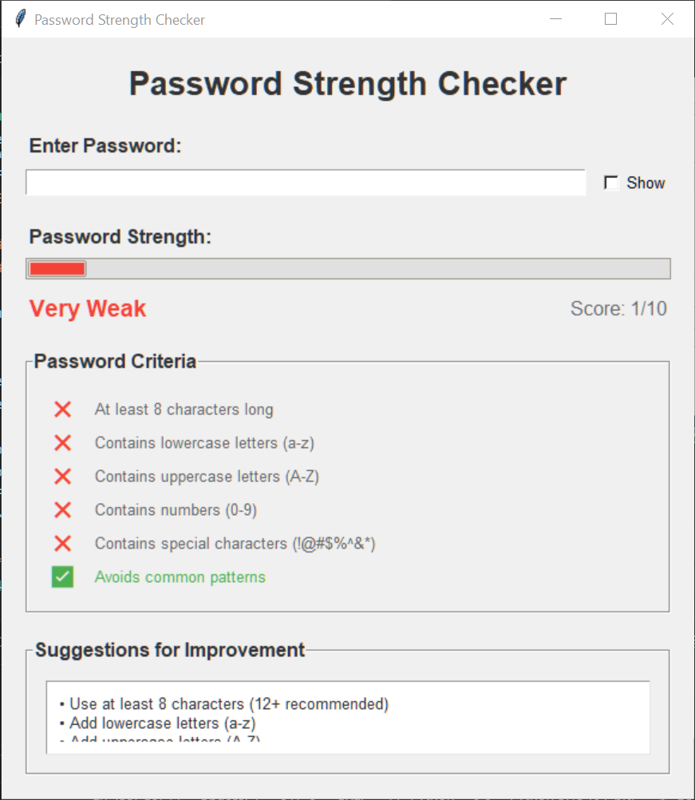
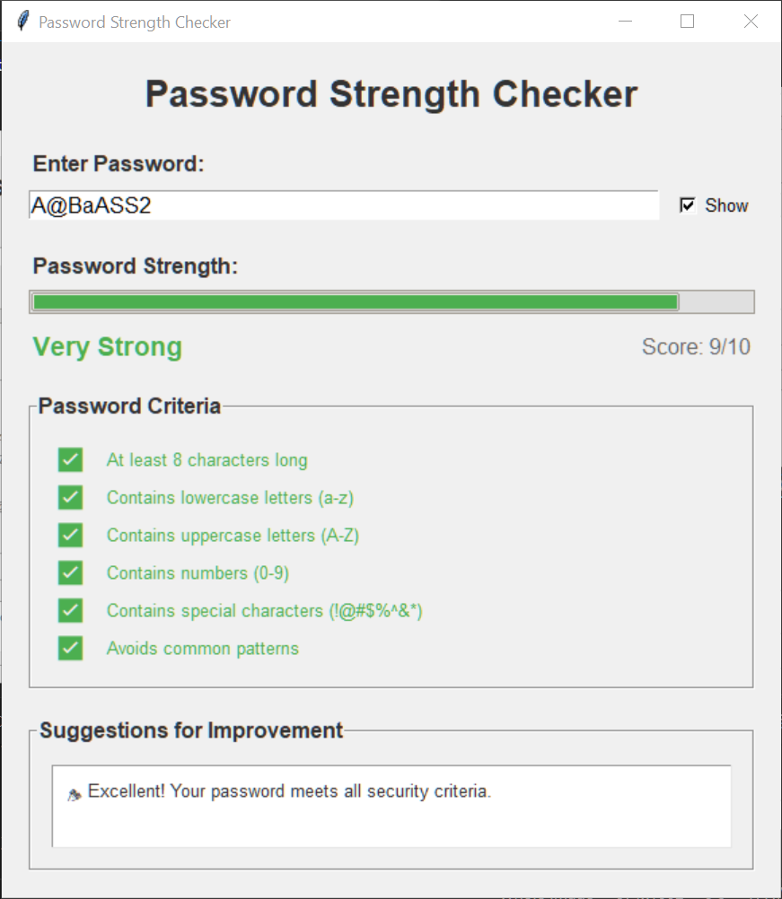

# Password Strength Checker GUI

A comprehensive password strength checker with an intuitive GUI built using Python's tkinter library. This tool helps users create strong, secure passwords by providing real-time feedback and detailed security analysis.

## Features

### 🔒 Real-time Password Analysis
- **Instant feedback** as you type
- **Color-coded strength indicator** from Very Weak (red) to Very Strong (green)
- **Progress bar visualization** showing password strength score

### 📊 Comprehensive Security Criteria
- **Length validation** (minimum 8 characters, recommended 12+)
- **Character variety checks**:
  - Lowercase letters (a-z)
  - Uppercase letters (A-Z)
  - Numbers (0-9)
  - Special characters (!@#$%^&*(),.?":{}|<>)
- **Pattern detection** to avoid common weak passwords
- **Visual checkmarks** showing which criteria are met

### 🛠 User-Friendly Interface
- **Show/Hide password** toggle for secure viewing
- **Detailed suggestions** with specific improvement recommendations
- **Scrollable feedback area** for comprehensive guidance
- **Clean, modern design** with intuitive controls

### 🎲 Password Generator
- **One-click strong password generation**
- **Guaranteed security** with all criteria met
- **12-character passwords** with optimal character variety
- **Automatic entry** into the password field

## Screenshots

### Main Interface


### Strong Password Example


## Installation

### Prerequisites
- Python 3.6 or higher
- tkinter (usually included with Python)

### Clone the Repository
```bash
git clone https://github.com/itz-danish/password-strength-checker.git
cd password-strength-checker
```

### No Additional Dependencies
This project uses only Python's built-in libraries, so no pip installation is required!

## Usage

### Running the Application
```bash
python password_checker_gui.py
```

### Using the Password Checker

1. **Enter a password** in the input field
2. **View real-time analysis**:
   - Strength level and score
   - Progress bar visualization
   - Criteria checklist with visual indicators
3. **Read improvement suggestions** in the feedback area
4. **Toggle password visibility** using the "Show" checkbox
5. **Generate strong passwords** using the "Generate Strong Password" button

### Password Strength Levels

| Level | Score | Color | Description |
|-------|-------|-------|-------------|
| Very Weak | 0-2 | Red | Easily crackable, needs major improvements |
| Weak | 3-4 | Red-Orange | Below security standards |
| Moderate | 5-6 | Orange | Acceptable but could be stronger |
| Strong | 7-8 | Light Green | Good security level |
| Very Strong | 9-10 | Green | Excellent security, meets all criteria |

## Security Criteria Explained

### Length Requirements
- **Minimum**: 6 characters (1 point)
- **Good**: 8 characters (2 points)
- **Excellent**: 12+ characters (3 points)

### Character Variety (1 point each)
- **Lowercase letters**: a, b, c, ..., z
- **Uppercase letters**: A, B, C, ..., Z
- **Numbers**: 0, 1, 2, ..., 9
- **Special characters**: !@#$%^&*(),.?":{}|<>

### Pattern Detection
The tool detects and penalizes common weak patterns:
- Sequential numbers (123456, 789, etc.)
- Sequential letters (abcdef, xyz, etc.)
- Common passwords (password, qwerty, admin)
- Repeated characters (aaa, 111, etc.)

### Character Type Variety Bonus
- **4 different types**: +2 points
- **3 different types**: +1 point

## Code Structure

```
password_checker_gui.py
├── PasswordStrengthChecker (Main Class)
│   ├── __init__()              # Initialize GUI
│   ├── setup_ui()              # Create interface elements
│   ├── check_password_strength() # Core password analysis logic
│   ├── check_password()        # Update UI with results
│   ├── generate_password()     # Create strong passwords
│   └── toggle_password_visibility() # Show/hide functionality
└── main()                      # Application entry point
```

## Examples

### Weak Password Example
**Input**: `password123`
- **Score**: 4/10 (Weak)
- **Missing**: Uppercase letters, special characters
- **Issues**: Common word pattern detected

### Strong Password Example
**Input**: `MyP@ssw0rd!2024`
- **Score**: 9/10 (Very Strong)
- **Meets**: All security criteria
- **Suggestions**: None - excellent password!

## Contributing

We welcome contributions! Here's how you can help:

### Reporting Issues
- Use the GitHub issue tracker
- Include steps to reproduce
- Provide system information (OS, Python version)

### Feature Requests
- Check existing issues first
- Describe the feature clearly
- Explain the use case

### Pull Requests
1. Fork the repository
2. Create a feature branch (`git checkout -b feature/amazing-feature`)
3. Commit changes (`git commit -m 'Add amazing feature'`)
4. Push to branch (`git push origin feature/amazing-feature`)
5. Open a Pull Request

### Development Setup
```bash
# Clone your fork
git clone https://github.com/itz-danish/password-strength-checker.git
cd password-strength-checker

# Create a development branch
git checkout -b feature/your-feature

# Make changes and test
python password_checker_gui.py
```

## License

This project is licensed under the MIT License - see the [LICENSE](LICENSE) file for details.

## Changelog

### v1.0.0 (Current)
- Initial release with GUI interface
- Real-time password strength checking
- Comprehensive security criteria analysis
- Password generator functionality
- Modern, user-friendly interface

## Roadmap

### Planned Features
- [ ] Password history and comparison
- [ ] Customizable security criteria
- [ ] Dark mode theme
- [ ] Password export functionality
- [ ] Breach database checking
- [ ] Multi-language support

## FAQ

**Q: Is my password stored anywhere?**
A: No, all password analysis happens locally in memory. Nothing is saved or transmitted.

**Q: Can I customize the security criteria?**
A: Currently, criteria are fixed but customization is planned for future versions.

**Q: Does this work on all operating systems?**
A: Yes, it works on Windows, macOS, and Linux with Python installed.

**Q: Why doesn't my strong password get a perfect score?**
A: The scoring system is conservative. Even good passwords might lose points for minor issues.

## Support

- **Documentation**: This README and inline code comments
- **Issues**: GitHub issue tracker
- **Discussions**: GitHub discussions for questions and ideas

## Acknowledgments

- Built with Python's tkinter for cross-platform compatibility
- Inspired by modern password security best practices
- Thanks to the cybersecurity community for guidance on password policies

---
## Contact 📬

For questions or feedback, open an issue on the [GitHub repository](https://github.com/itz-danish/password-strength-checker/) or contact on LinkedIn [Mohammad Danish](https://www.linkedin.com/in/mohammad-danish-76570a24a/) .

---

**⭐ If you find this tool helpful, please star the repository!**

**🔐 Stay secure, use strong passwords!**

---


## 👤 Creator  
Made with ❤️ by **Mohammad Danish**  

📌 **LinkedIn:** [Mohammad Danish](https://www.linkedin.com/in/mohammad-danish-76570a24a/)  
📷 **Instagram:** [@\_Itz\_danish\_](https://www.instagram.com/_itz_danish_/) 
